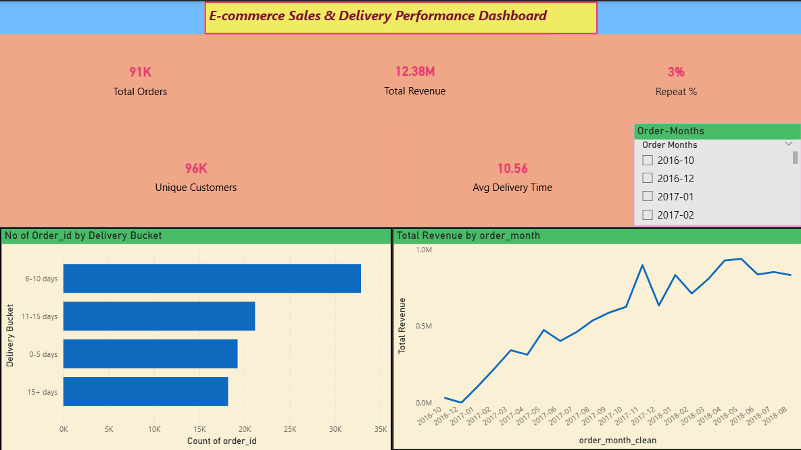
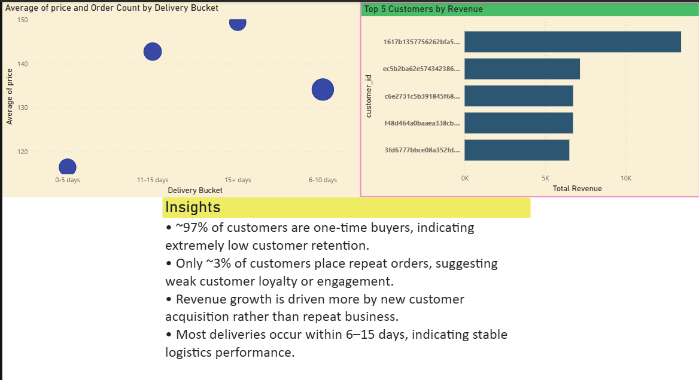

# 📊 E-commerce Sales & Customer Retention Analysis

## 🚀 Project Overview
This project analyzes an E-commerce dataset to uncover insights about **customer behavior, revenue trends, delivery performance, and retention**.

The goal is to move beyond basic reporting and identify **business-critical insights** such as:
- Customer retention vs acquisition
- Revenue concentration
- Delivery efficiency impact

---

## ❗ Business Problem
The company shows strong growth in revenue but extremely low customer retention.

This project investigates:
- Why customers are not returning  
- Whether revenue growth is sustainable  
- If delivery performance impacts customer behavior  

---

## 🛠 Tools & Technologies
- **SQL (PostgreSQL)** → Data extraction & analysis  
- **Python (Pandas, NumPy)** → Data cleaning & preprocessing  
- **Power BI** → Dashboard & visualization  

---

## 📂 Project Structure
```
Ecommerce-sales-analysis/
│
├── data/              # Cleaned datasets
├── sql/               # SQL queries
├── notebooks/         # Python analysis
├── powerbi/           # Power BI dashboard (.pbix)
├── images/            # Dashboard screenshots
└── README.md
```

---

## ⚙️ Data Processing Steps
- Removed null values and invalid timestamps  
- Created delivery buckets from delivery time  
- Aggregated revenue at customer and monthly level  
- Joined customer and order datasets for analysis  

---

## 📊 Key Insights

### Customer Behavior
- ~97% of customers are one-time buyers  
- Only ~3% are repeat customers  
→ Indicates a critical retention problem, where the business is unable to convert first-time buyers into repeat customers  

---

### Revenue Insights
- Revenue growth is heavily dependent on new customer acquisition rather than repeat purchases, making it unsustainable long-term  
- A small group of customers contributes a disproportionate share of revenue  

---

### Delivery Performance
- Most deliveries occur within 6–15 days  
- Slight variation in order value across delivery durations  

---

### Business Implication
- The business is heavily dependent on acquiring new customers  
- Lack of retention strategy poses long-term revenue risk  
- The analysis reveals a classic acquisition-heavy growth model, which can lead to high marketing costs and unstable long-term revenue  

---

## 📈 Dashboard Preview

### Main Dashboard


### Customer & Delivery Insights


---

## ⚙️ How to Use
1. Load datasets from the `data/` folder  
2. Run SQL queries from `sql/analysis.sql`  
3. Open `powerbi/Ecommerce_projectdb.pbix` in Power BI  

---

## 💡 Recommendations
- Introduce loyalty programs to improve retention  
- Target high-value customers with personalized offers  
- Improve delivery efficiency to enhance customer experience  
- Shift focus from acquisition-heavy strategy to retention-driven growth  

---

## 🧠 What I Learned
- Building end-to-end data workflows (SQL → Python → Power BI)  
- Cleaning and transforming real-world messy datasets  
- Writing analytical SQL queries using joins, aggregations, and window functions  
- Translating data into actionable business insights  

---

## 🔗 Dataset Source
Olist Brazilian E-commerce Dataset (Public dataset)

---

## 📌 Future Improvements
- Cohort-based retention analysis  
- Customer segmentation (RFM analysis)  
- Predictive modeling for repeat customer behavior  
